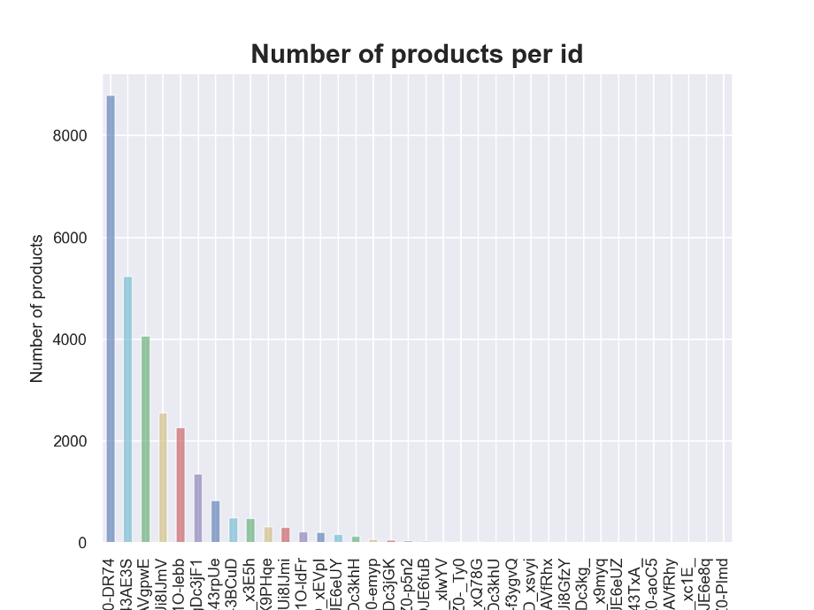
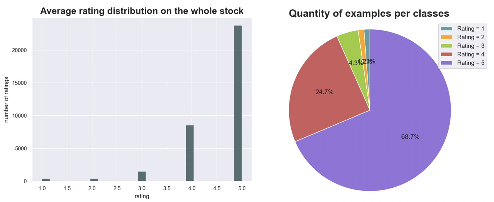
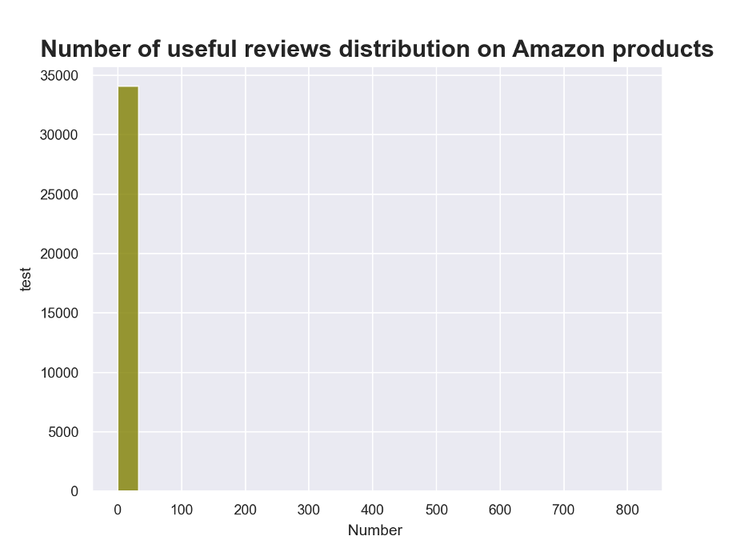

# sentiment-analysis-on-Amazon-reviews

## What is opinion mining?

In computer science, opinion mining also referred to as sentiment analysis is an approach of natural language processing referring to an analysis that identifies the tone emerging from a body of text on large amounts of data. It aims to determine an evaluation, a judgement or more overall an emotional state with regard to a given topic.

Opinion mining is a growing and promising research field widely applied to reviews and social media to categorize opinions.

## Why is it so useful nowadays?

In the recent years, we have been witnessing the explosion of what is commonly referred to as participatory sensing. Ordinary people take a proactive role in posting comments and complaints online, increasingly using technology to record information about events and issues in all dimensions of their political and social life.  It can be about a political candidate they like, an article they didn't like, ...
Hence the reason why opinion mining approaches are seen as the cornerstones of largescale collaborative policymaking. 

*	Political Sphere: 
> In the context of political activism, everyone is not only eager to share their political orientation but also curious to know the voice of others. Social media platforms make it easy to capture the numerous aspects of public opinion. These sites have begun to have a significant impact on how people think and act and thus are becoming essential to provide support to the verification of population trends in politics domain. Extracting citizens' opinions on government decisions from social media is therefore an increasingly important issue.

*	Retail Sales
> With the evolution of traditional stores to online shopping over the time, product reviews are becoming more and more important. Consumers around the world are sharing reviews directly on product pages in real time creating one huge database which is constantly being updated. For example, the amount of reviews on Amazon has increased tremendously over the past years. This vast amount of consumer reviews creates an opportunity for businesses to see how the market reacts to a specific product and how a given company can adapt its stocks. If businesses are able to categorize products according to certain patterns based on their reviews it could help them choose which type of products should be dropped from their stock, which one should they keep, and which others could they get. For example, if a group of different suitcases is highly rated and that people seem to like the materials, the dimensions and the colors, it probably means that products with similar proprieties should be kept.

## Project

The objective of this project is to analyze the correlation between the Amazon product reviews and the rating of the products given by consumers. I would like to create a supervised learning model able to classify a given customer review as positive, neutral and negative, and thus affect an overall score to a given review: is the consumer happy of his purchase? Is he disappointed? Is he just neutral? 

## Difficulties
It is possible to give a computer the ability to understand the overall emotion emanating from a body of text, but it needs to understand which are the most influential words in the text, which word should be priotarized, it should be able to understand the meaning of successions of words that can mean a whole different thing than taken apart. Also, it is very difficult for a computer to recognize sarcasm. Since the data is written by different customers, there may be various typos, nonstandard spellings, and other variations that may not be found in curated sets of published text. Comments must all be written in the same language (English in our case). The last difficulty concerns the dataset: it must contain as many negative, neutral and positive examples in order to train our model correctly.

## Dataset
The dataset I will be using comes from Kaggle.com and is a sample of a larger dataset available through Datafiniti. It lists 34,660 consumer reviews of Amazon manufactured products including their ratings, reviews, names and more.

This figure shows that some products have many reviews while others have very little reviews. This can be a problem because the more different reviews (and therefore words) we have, the better we can train the model. Here, most of the reviews refer to the same product, which can limit the range of emotions and words. We need to get an overall picture of the distribution of the ratings to see if there are other problems with our dataset.

Ratings:
We notice that over the 36640 data points, only 34627 have a rating value. Thus 36640-34627=2013 data points won’t be useful in our analysis. We can drop them from the dataset.

Overall idea:
In order to have a brief overview of the dataset, we plot the distribution of the ratings. We have 5 classes (ratings from 1 to 5). We notice that the data we have is not well distributed, the classes are not represented equally: the majority of the products that were rated, were rated highly. There is more than twice as many 5-star ratings as all other ratings combined. About 70% of the dataset belongs only to 1 class (5-star ratings). This is an imbalanced dataset.

Most classification datasets do not have exactly equal number of instances in each class, but a small difference often does not matter. However, in our case we have a significant class imbalance and it can cause problems. This imbalance is expected since the dataset characterize the overall appreciation of Amazon manufactured products. The vast majority of the products will be highly rated otherwise they will be dropped of the stock. 

Among the data set is also the number of helpful votes for a given review. The distribution of useful reviews is as follow:

It is noticeable that very few comments were designated as "helpful" by other consumers and this is why outliers are valuable. We may want to weight reviews that had many people who find them helpful.

## Key results
